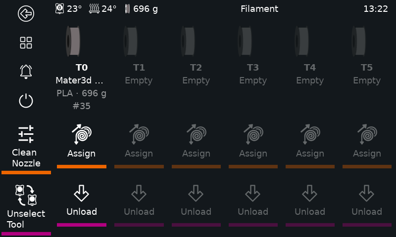
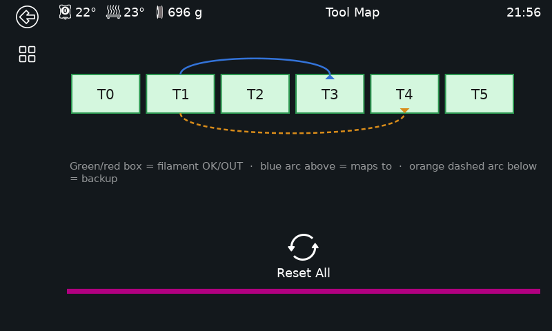
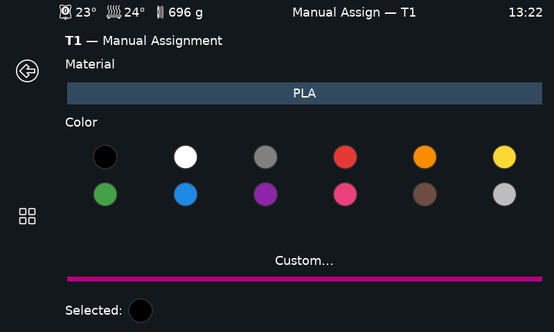
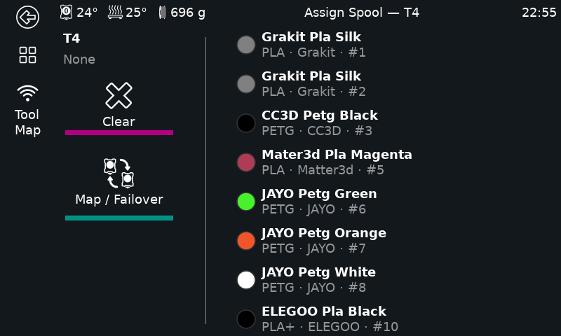
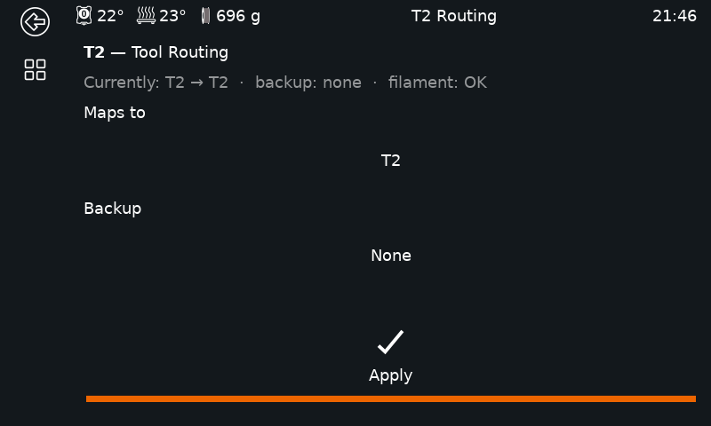

# Tool Feeder

> **⚠ Experimental.** Under active development and tested on a limited set of
> hardware. Expect rough edges. Review generated configs before use and keep
> an eye on your printer — use at your own risk.

Filament management for Klipper toolchangers — automated per-tool loading,
live filament-lane status on the touchscreen, and Spoolman integration. Pick
any combination of:

- **Filament Feeder** — automated per-tool filament loading (macros + a buffer
  sync module supporting both one- and two-sensor hardware)
- **Spoolman Lane Sync** — background service that syncs Spoolman spool data into
  Moonraker's `lane_data` so OrcaSlicer sees what's loaded in each tool slot
- **KlipperScreen Filament Lanes** — a touchscreen panel showing live filament-lane
  status per tool

Each component installs independently.

## Screenshots

| Filament Lanes | Tool Map |
| --- | --- |
|  |  |
| Live per-lane status, right from the sidebar | Every tool's mapping at a glance |

| Manual Assign | Spoolman Assign |
| --- | --- |
|  |  |
| Color/material assignment without Spoolman | Pick a spool straight from Spoolman |

| Tool Routing |
| --- |
|  |
| Per-lane remap/failover target |

---

## Requirements

- Klipper installed (for Filament Feeder)
- Moonraker + Spoolman installed (for Spoolman Lane Sync and richer KlipperScreen data)
- KlipperScreen installed (for the KlipperScreen panel)

None of these are required unless you install the component that needs them —
you'll get a clear message if a prerequisite is missing.

## Install

Run this one-liner on your printer's SSH session — no cloning required:

```bash
bash <(curl -fsSL https://raw.githubusercontent.com/broncosis/Tool_feeder/main/install.sh)
```

Or clone and run locally:

```bash
git clone https://github.com/broncosis/Tool_feeder.git
cd Tool_feeder
./install.sh
```

The installer detects your Klipper and config directories, lets you pick which
components to install, and — for Filament Feeder — asks about your setup:

- Whether you run Spoolman
- Number of tools — auto-detected from Klipper when possible, otherwise asked
  with a sensible default
- Load/unload temperature
- Whether you have physical unload buttons at the feeder (default yes — say
  no if you'd rather trigger unloads from the KlipperScreen panel or your own
  macro instead)
- Feeder MCU — picked from detected `/dev/serial/by-id/*` devices

From your answers it **generates** `feeder.cfg` and one `T0.cfg`..`T{n-1}.cfg`
per tool, instead of shipping static examples you'd otherwise hand-copy per
tool. A couple of things default to reasonable values instead of being asked
outright — edit them afterward if yours differ: purge bucket position
(`bucket_x=25`, `bucket_y=-4`) and Bowden tube length (1400mm).

The buffer sync module defaults to two-sensor mode (adds jam detection). If
your hardware only has one sensor, each tool's generated config already
includes a ready single-sensor block, commented out — just swap which one's
commented to switch.

What the installer *can't* know — per-tool pin wiring, TMC UART pins, CAN bus
UUIDs, dock park position, input shaper tuning — comes out as clearly marked
`CHANGE_ME_*` placeholders. Find them all with:

```bash
grep -rn CHANGE_ME_ ~/printer_data/config/feeder.cfg ~/printer_data/config/T*.cfg
```

Re-running the installer never silently overwrites `feeder.cfg` or a `T{n}.cfg`
you already have — it backs the old one up first (`feeder.cfg.bak.<timestamp>`,
next to the original), then offers to carry over any real values you already
filled in (pins, `canbus_uuid`, dock position, etc.) into the newly generated
file, so re-running to change one setting doesn't mean re-entering everything
else from scratch.

For KlipperScreen: if Spoolman isn't installed, the panel's "Assign" button
goes straight to a manual color/material picker instead of a Spoolman browser
— pick a color from a preset swatch grid (or a custom color picker) and a
material from a tap-to-select list backed by `src/printer/materials.cfg` (edit
that file to add more materials). If Spoolman *is* installed, "Assign" offers a
choice between the two, per lane.

Every lane also has a **Map / Failover** page for tool remapping (e.g. route
T1 to T3 if T1 runs out) and backup-tool assignment, plus a **Tool Map**
overview reachable from the sidebar of any Filament screen, showing every
tool's current mapping and backup at a glance.

The installer also offers to add a single `[update_manager tool_feeder]` entry
to `moonraker.conf` covering whichever components you installed, so a `git
pull` on this repo updates all of them together. Spoolman Lane Sync gets
registered in `moonraker.asvc` so Moonraker is allowed to manage its service.

## Calibrating the Feeders

Each tool's feeder stepper has its own `rotation_distance` in `feeder.cfg`
(`[extruder_stepper _tool{n}_feeder]`) — how far it actually pushes filament
per motor rotation. If it's off, the buffer sync fights a constant bias
instead of correcting for real slack: `feeder_buffer`'s live `debug_console`
output (see below) can end up pinned on one state the entire print instead
of oscillating, because it's compensating for a miscalibrated base rate
rather than genuine feed/draw drift.

To calibrate tool `N`'s feeder independently of the toolhead extruder it's
synced to:

1. Make sure `[force_move] enable_force_move: True` is set somewhere in your
   config (required for the command below — Klipper won't run it otherwise).
2. Mark the filament with a pen right where it enters the feeder body (not
   at the hotend — you're measuring the feeder's own output).
3. Run a slow, known-distance test move on just that feeder stepper:

   ```
   FORCE_MOVE STEPPER="extruder_stepper _tool{N}_feeder" DISTANCE=100 VELOCITY=5
   ```

   The quotes around `STEPPER=` are required — the value contains a space,
   and Klipper's gcode parser splits on whitespace otherwise.
4. Measure how far the mark actually moved past your reference point.
5. Recalculate: `new_rotation_distance = old_rotation_distance * (measured_mm / 100)`.
6. Update `rotation_distance` for that tool in `feeder.cfg` and `RESTART`
   (a plain config edit doesn't take effect until Klipper reloads — or test
   live first with `SET_EXTRUDER_ROTATION_DISTANCE EXTRUDER=_tool{N}_feeder
   DISTANCE=<value>`, which applies immediately without a restart).

Repeat the measurement afterward to confirm it lands close to 100mm.

## Debugging a Buffer

`feeder_buffer`'s `debug_console` option (default `True`, see
`src/printer/feeder_buffer_spec.md`) prints every state change
(`Buffer T0: neutral -> advancing`, etc.) to the console, so you can confirm
a buffer is actually reacting to filament movement rather than just trusting
it silently. If it's pinned on one state indefinitely:

- Check with the printer idle first — if it's already pinned with no
  filament moving at all, that's a mechanical issue (spring tension, switch
  position), not a feed-rate one.
- If it only pins during printing, recalibrate that tool's `rotation_distance`
  (above) before assuming a sensor/wiring problem.
- If it's pinned on the *same* state no matter what you change the base
  calibration to — including deliberately making the mismatch worse — check
  `invert_sensor` (single-sensor mode only). If the sensor's active/inactive
  reading is backwards from what the code expects, the correction reinforces
  the drift instead of fixing it, so it never crosses back to the other
  state. Toggling `invert_sensor: True`/`False` for that tool flips which
  state gets the speed-up vs. slow-down correction.

Set `debug_console: False` per-tool once you've confirmed it's behaving, to
keep the console quiet during real prints.

## Credits

See [CREDITS.md](CREDITS.md) for full attribution.

## License

GPL v3 — see [LICENSE](LICENSE).
